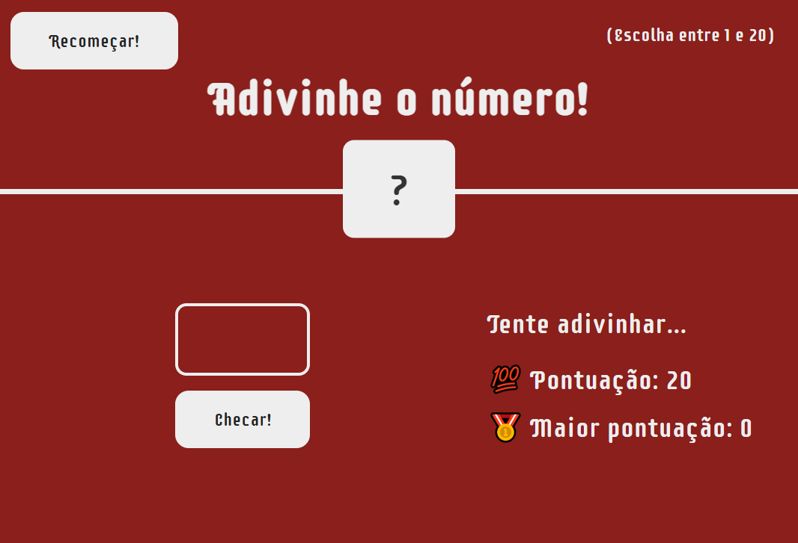
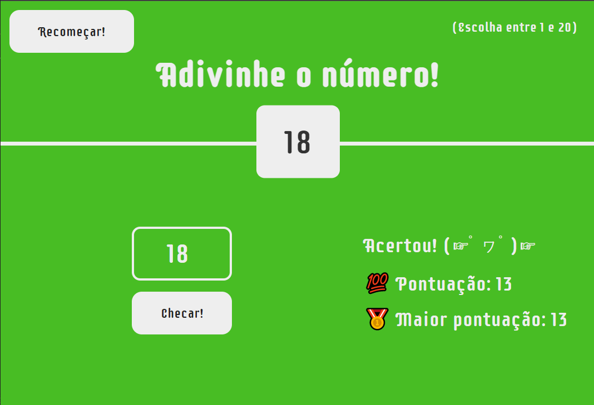

# Adivinha-número

## Opa oi oi! Trago aqui um projeto que fiz visando aplicar e testar meus conhecimentos de manipulação da árvore DOM via JavaScript. Você pode acessar o projeto <a target="_blank" href="https://gabezrodz.github.io/adivinha-numero/">clicando aqui!</a>

O jogo consiste em você tentar adivinhar o número  com menos tentativas possíveis!

## 👨‍💻 Linguagens utilizadas:

 
    
    
      

## 📱 Dispositivos homologados:
A aplicação opera nas seguintes dimensões de telas:
- 1440px
- 720px
- 480px
- 380px

## 🕹 Para jogar:
- Escolha um valor entre 1 e 20 e insira-o
na caixa a esquerda; 
- Clique em checar;
- Observe as dicas para saber se está perto do resultado;
- Após finalizar o jogo, você pode reiniciar clicando no botão  "Recomeçar";
- Divirta-se!

